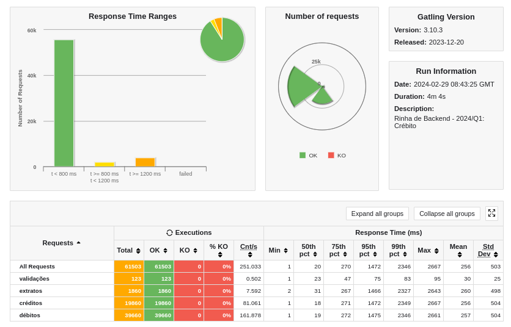

### BEF

servidor web com ruby puro e a gem pg para conexão com o banco de dados postgres

- sem pool de conexões no pg
- sql select account bloqueante
- transaction na inserção de dados
- sem threads no server
- nginx com 512 conexões por worker
- recursos iliimitados por enquanto
- sem newtwork_mode: host
- sem fsync off no pg

lento sim mas funciona e 0 K.O (nem sempre kkkk versão 1.0 inconsistente)

### Referências:

- [Build Your Own Web Server With Ruby](https://www.rubyguides.com/2016/08/build-your-own-web-server/)
- [sinatrinha-do-povo](https://github.com/davide-almeida/sinatrinha-do-povo/tree/main)
- [yata](https://github.com/leandronsp/yata)
- [tonico](https://github.com/leandronsp/tonico)
