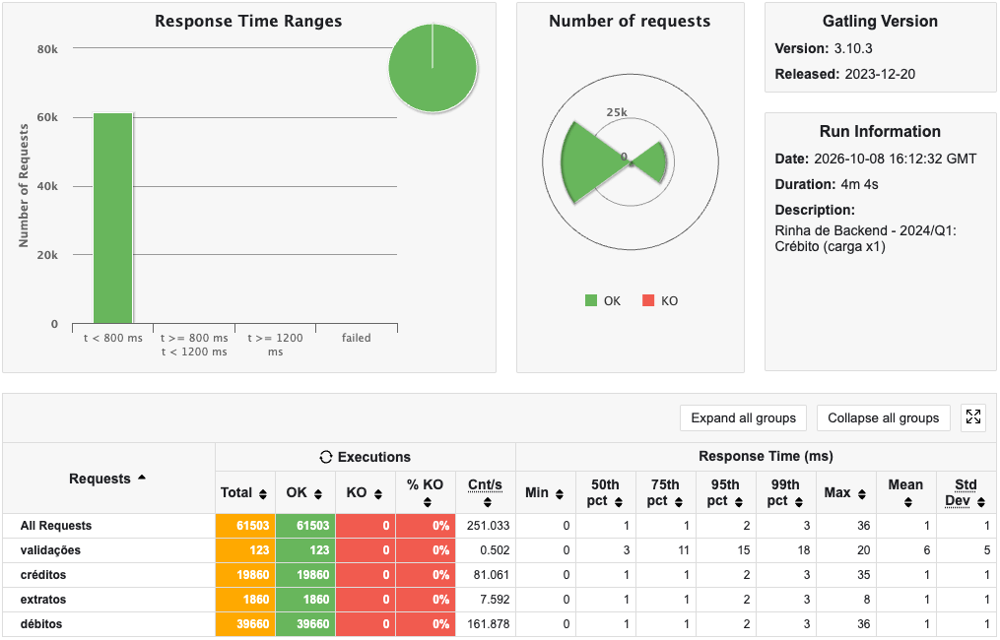
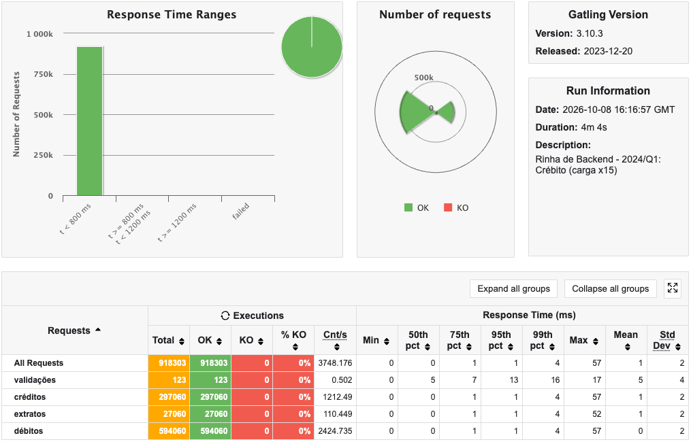
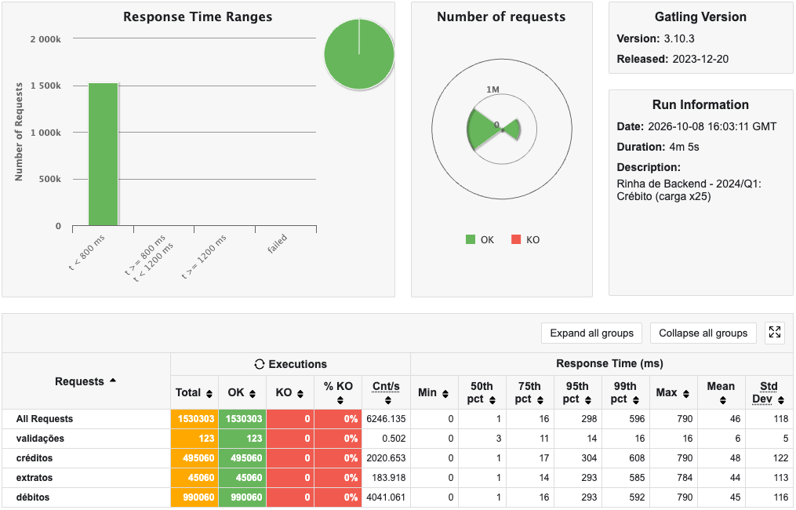

### BEF

Servidor web síncrono em Ruby puro (`TCPServer` + gem `pg`) para a [Rinha de Backend 2024/Q1](https://github.com/zanfranceschi/rinha-de-backend-2024-q1).

- 2 APIs single-thread, uma conexão com o Postgres por processo, atrás do nginx via unix socket
- uma instrução SQL por request: débito atômico via `UPDATE ... WHERE balance + valor >= -limite` + `INSERT` na mesma CTE; extrato num único snapshot
- statements preparados
- recursos dentro da regra: 1,5 CPU e 550MB no total
- sem `network_mode: host` e sem `fsync off`

### Rodando

```sh
docker compose up -d --build
./teste-carga.sh           # teste oficial da Rinha (Gatling 3.10.3) em Docker
CARGA=10 ./teste-carga.sh  # 10x as requisições/s oficiais
```

### Resultado local

Carga oficial:



15x a carga oficial (`CARGA=15`):



25x a carga oficial (`CARGA=25`):



### Referências:

- [Build Your Own Web Server With Ruby](https://www.rubyguides.com/2016/08/build-your-own-web-server/)
- [sinatrinha-do-povo](https://github.com/davide-almeida/sinatrinha-do-povo/tree/main)
- [yata](https://github.com/leandronsp/yata)
- [tonico](https://github.com/leandronsp/tonico)
